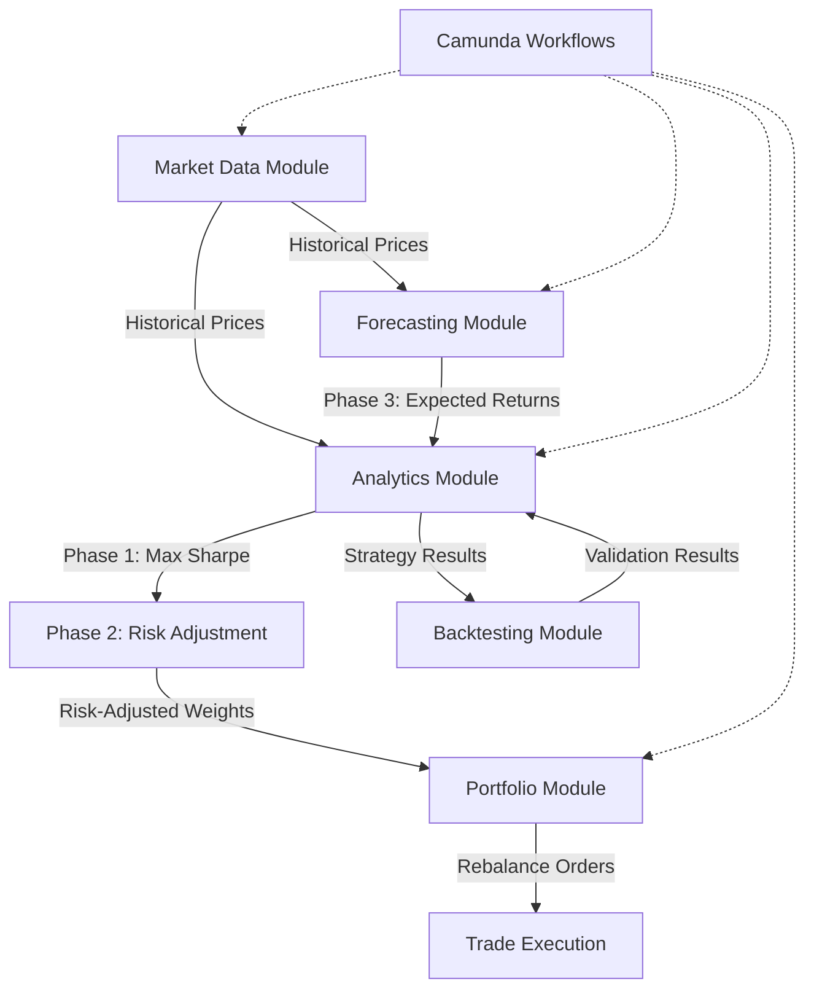

# Modern Portfolio Theory Trading Platform - Spring Boot Module Architecture

## 🏛️ **Module-Based Spring Boot Architecture (Microservices-Ready)**

```
trading_platform/
├── 📦 src/main/java/com/ahd/trading_platform/   # Spring Boot Application Root
│   ├── 🔸 marketdata/                           # ✅ Market Data Module (Completed)
│   │   ├── domain/                              # Domain Layer - Pure Business Logic
│   │   │   ├── entities/
│   │   │   │   ├── MarketInstrument.java        # Aggregate root with OHLCV price history
│   │   │   │   └── PriceData.java               # Price data entity
│   │   │   ├── valueobjects/
│   │   │   │   ├── Price.java                   # Immutable price record
│   │   │   │   ├── OHLCV.java                   # Open-High-Low-Close-Volume record
│   │   │   │   ├── TimeRange.java               # Time period for queries
│   │   │   │   ├── TradingInstrument.java       # BTC, ETH enum
│   │   │   │   ├── DataQualityMetrics.java      # Data validation metrics
│   │   │   │   └── BybitMarketType.java         # LINEAR futures market type
│   │   │   ├── repositories/                    # Repository contracts
│   │   │   │   ├── MarketInstrumentRepository.java
│   │   │   │   ├── BtcPriceRepository.java      # Asset-specific repositories
│   │   │   │   └── EthPriceRepository.java
│   │   │   ├── services/
│   │   │   │   ├── DataValidationService.java   # Domain validation logic
│   │   │   │   └── ExternalDataClientStrategy.java # Strategy pattern interface
│   │   │   └── events/
│   │   │       └── MarketDataUpdatedEvent.java  # Domain events
│   │   ├── application/                         # Application Layer - Use Cases
│   │   │   ├── usecases/
│   │   │   │   └── FetchHistoricalDataUseCase.java # Main use case
│   │   │   ├── dto/
│   │   │   │   ├── MarketDataRequest.java       # API request DTOs
│   │   │   │   └── MarketDataResponse.java      # API response DTOs
│   │   │   └── services/
│   │   │       └── MarketDataApplicationService.java
│   │   ├── infrastructure/                      # Infrastructure Layer
│   │   │   ├── external/
│   │   │   │   ├── BybitFeignClient.java        # External API client
│   │   │   │   ├── BybitDataClientStrategy.java # Strategy implementation
│   │   │   │   ├── ExternalDataClientFactory.java # Strategy factory
│   │   │   │   └── mappers/
│   │   │   │       └── BybitMapper.java         # Data mapping
│   │   │   ├── persistence/
│   │   │   │   ├── entities/                    # JPA entities
│   │   │   │   │   ├── MarketInstrumentEntity.java
│   │   │   │   │   ├── BtcPriceEntity.java      # Asset-specific tables
│   │   │   │   │   └── EthPriceEntity.java
│   │   │   │   └── repositories/
│   │   │   │       └── JpaMarketInstrumentRepository.java
│   │   │   └── config/
│   │   │       ├── MarketDataConfiguration.java # Spring configuration
│   │   │       ├── MarketDataProperties.java    # Configuration properties
│   │   │       └── RateLimiterConfig.java       # Resilience4j rate limiting
│   │   └── interfaces/                          # Interface Layer
│   │       ├── rest/
│   │       │   └── MarketDataController.java    # REST endpoints
│   │       └── camunda/
│   │           └── FetchInstrumentDataTaskWorker.java # External task worker
│   │
│   ├── 🔸 analytics/                           # 🆕 Analytics Module (Trading Model Phase 1 & 2)
│   │   ├── domain/
│   │   │   ├── entities/
│   │   │   │   ├── TradingModel.java            # Phase 1 & 2 aggregate root
│   │   │   │   ├── OptimizationResult.java      # Sharpe ratio optimization result
│   │   │   │   └── StrategyRecommendation.java  # Final recommendation
│   │   │   ├── valueobjects/
│   │   │   │   ├── ExpectedReturn.java          # Phase 1 input
│   │   │   │   ├── SharpeRatio.java            # Optimization target
│   │   │   │   ├── PortfolioWeights.java       # Phase 1 output
│   │   │   │   ├── RiskPreference.java         # Phase 2 input (Averse/Neutral/Lover)
│   │   │   │   ├── RiskAdjustedWeights.java    # Phase 2 output
│   │   │   │   ├── CovarianceMatrix.java       # Risk calculations
│   │   │   │   └── ConstraintSet.java          # Investment constraints
│   │   │   ├── repositories/
│   │   │   │   └── TradingModelRepository.java
│   │   │   └── services/
│   │   │       ├── ExpectedReturnCalculator.java    # Calculates from historical data
│   │   │       ├── SharpeRatioOptimizer.java       # Phase 1: Max Sharpe Ratio
│   │   │       ├── RiskAdjustmentService.java      # Phase 2: Risk preference
│   │   │       └── CovarianceCalculator.java       # Risk matrix calculations
│   │   ├── application/
│   │   │   ├── usecases/
│   │   │   │   ├── CalculateExpectedReturnsUseCase.java
│   │   │   │   ├── OptimizeForSharpeRatioUseCase.java    # Phase 1
│   │   │   │   ├── AdjustForRiskPreferenceUseCase.java   # Phase 2
│   │   │   │   └── RunTradingModelUseCase.java           # Orchestrates both phases
│   │   │   └── dto/
│   │   │       ├── OptimizationRequest.java
│   │   │       └── TradingModelResult.java
│   │   ├── infrastructure/
│   │   │   ├── optimization/
│   │   │   │   ├── QuadraticProgrammingOptimizer.java   # Optimization engine
│   │   │   │   └── ApacheCommonsOptimizer.java          # Alternative implementation
│   │   │   └── persistence/
│   │   │       └── entities/
│   │   │           └── TradingModelResultEntity.java
│   │   └── interfaces/
│   │       ├── rest/
│   │       │   └── AnalyticsController.java
│   │       └── camunda/
│   │           └── RunTradingModelWorker.java
│   │
│   ├── 🔸 forecasting/                         # 🆕 Forecasting Module (Phase 3 - ARIMA)
│   │   ├── domain/
│   │   │   ├── entities/
│   │   │   │   ├── ARIMAModel.java              # Phase 3 aggregate root
│   │   │   │   ├── ForecastResult.java          # Prediction results
│   │   │   │   └── StationarityTest.java        # Statistical test results
│   │   │   ├── valueobjects/
│   │   │   │   ├── ARIMAParameters.java         # (p,d,q) parameters
│   │   │   │   ├── ForecastHorizon.java         # Prediction time window
│   │   │   │   ├── ConfidenceInterval.java      # Prediction bounds
│   │   │   │   └── StationarityMetrics.java     # ADF test results
│   │   │   ├── repositories/
│   │   │   │   └── ARIMAModelRepository.java
│   │   │   └── services/
│   │   │       ├── StationarityTestService.java     # Phase 3: Stationarity testing
│   │   │       ├── ARIMAParameterOptimizer.java     # Model selection (p,d,q)
│   │   │       └── ForecastGeneratorService.java    # Generate predictions
│   │   ├── application/
│   │   │   ├── usecases/
│   │   │   │   ├── TestStationarityUseCase.java
│   │   │   │   ├── OptimizeARIMAParametersUseCase.java
│   │   │   │   ├── GenerateForecastUseCase.java
│   │   │   │   └── PredictExpectedReturnsUseCase.java   # Main Phase 3 use case
│   │   │   └── dto/
│   │   │       ├── ForecastRequest.java
│   │   │       └── ForecastResponse.java
│   │   ├── infrastructure/
│   │   │   ├── forecasting/
│   │   │   │   ├── ApacheCommonsARIMA.java       # ARIMA implementation
│   │   │   │   └── WEKATimeSeriesEngine.java     # Alternative ML approach
│   │   │   └── persistence/
│   │   │       └── entities/
│   │   │           └── ARIMAModelEntity.java
│   │   └── interfaces/
│   │       ├── rest/
│   │       │   └── ForecastingController.java
│   │       └── camunda/
│   │           └── GenerateForecastWorker.java
│   │
│   ├── 🔸 backtesting/                         # 🆕 Backtesting Module
│   │   ├── domain/
│   │   │   ├── entities/
│   │   │   │   ├── BacktestSession.java         # Historical test aggregate root
│   │   │   │   ├── BacktestResult.java          # Performance results
│   │   │   │   └── TradingSimulation.java       # Simulation execution
│   │   │   ├── valueobjects/
│   │   │   │   ├── BacktestPeriod.java          # Historical time range
│   │   │   │   ├── PerformanceMetrics.java      # Sharpe, volatility, drawdown
│   │   │   │   ├── SimulationConfig.java        # Test parameters
│   │   │   │   └── TradeSimulation.java         # Individual trade simulation
│   │   │   ├── repositories/
│   │   │   │   └── BacktestRepository.java
│   │   │   └── services/
│   │   │       ├── BacktestEngineService.java       # Main backtesting logic
│   │   │       ├── PerformanceCalculatorService.java # Metrics calculation
│   │   │       └── ComparisonAnalysisService.java    # Strategy comparison
│   │   ├── application/
│   │   │   ├── usecases/
│   │   │   │   ├── RunBacktestUseCase.java
│   │   │   │   ├── AnalyzePerformanceUseCase.java
│   │   │   │   └── CompareStrategiesUseCase.java
│   │   │   └── dto/
│   │   │       ├── BacktestRequest.java
│   │   │       └── BacktestReport.java
│   │   ├── infrastructure/
│   │   │   ├── simulation/
│   │   │   │   ├── VectorizedBacktester.java    # High-performance backtesting
│   │   │   │   └── EventDrivenBacktester.java   # Realistic simulation
│   │   │   └── persistence/
│   │   │       └── entities/
│   │   │           └── BacktestResultEntity.java
│   │   └── interfaces/
│   │       ├── rest/
│   │       │   └── BacktestingController.java
│   │       └── camunda/
│   │           └── RunBacktestWorker.java
│   │
│   ├── 🔸 portfolio/                           # 🆕 Portfolio Module (Real Portfolio Management)
│   │   ├── domain/
│   │   │   ├── entities/
│   │   │   │   ├── Portfolio.java               # Real portfolio aggregate root
│   │   │   │   ├── Position.java                # Individual asset positions
│   │   │   │   ├── Trade.java                   # Executed trades
│   │   │   │   └── RebalanceOrder.java          # Rebalancing instructions
│   │   │   ├── valueobjects/
│   │   │   │   ├── PortfolioValue.java          # Total portfolio value
│   │   │   │   ├── Allocation.java              # Current asset allocation
│   │   │   │   ├── RebalanceInstruction.java    # Trading instructions
│   │   │   │   └── RiskExposure.java            # Current risk metrics
│   │   │   ├── repositories/
│   │   │   │   ├── PortfolioRepository.java
│   │   │   │   └── TradeRepository.java
│   │   │   └── services/
│   │   │       ├── RebalancingService.java          # Uses analytics results
│   │   │       ├── RiskMonitoringService.java       # Real-time risk tracking
│   │   │       ├── PerformanceTrackingService.java  # Portfolio performance
│   │   │       └── TradeExecutionService.java       # Order execution
│   │   ├── application/
│   │   │   ├── usecases/
│   │   │   │   ├── RebalancePortfolioUseCase.java   # Uses analytics recommendations
│   │   │   │   ├── MonitorRiskUseCase.java
│   │   │   │   └── TrackPerformanceUseCase.java
│   │   │   └── dto/
│   │   │       ├── PortfolioSnapshot.java
│   │   │       └── RebalanceReport.java
│   │   ├── infrastructure/
│   │   │   ├── execution/
│   │   │   │   └── MockTradeExecutor.java        # Simulated trade execution
│   │   │   └── persistence/
│   │   │       └── entities/
│   │   │           ├── PortfolioEntity.java
│   │   │           └── TradeEntity.java
│   │   └── interfaces/
│   │       ├── rest/
│   │       │   └── PortfolioController.java
│   │       └── camunda/
│   │           └── RebalancePortfolioWorker.java
│   │
│   ├── 🔧 shared/                              # Shared Kernel
│   │   ├── kernel/
│   │   │   ├── valueobjects/
│   │   │   │   ├── Money.java                   # Common monetary value object
│   │   │   │   ├── Percentage.java              # Common percentage type
│   │   │   │   └── DateRange.java               # Common date range
│   │   │   ├── exceptions/
│   │   │   │   ├── TradingPlatformException.java
│   │   │   │   └── ValidationException.java
│   │   │   └── events/
│   │   │       ├── DomainEvent.java             # Base event interface
│   │   │       └── EventPublisher.java          # Event publishing contract
│   │   └── constants/
│   │       ├── TradingConstants.java            # Trading-specific constants
│   │       └── ProcessVariables.java            # Camunda process variables
│   │
│   └── TradingPlatformApplication.java         # Main Spring Boot application
│
├── 📁 src/main/resources/
│   ├── application.yaml                        # Main configuration
│   ├── camunda-processes/                      # BPMN workflow definitions
│   │   ├── fetch_instrument_data.bpmn
│   │   ├── run_trading_model.bpmn
│   │   ├── generate_forecast.bpmn
│   │   └── rebalance_portfolio.bpmn
│   └── db/migration/                           # Database migrations
│
├── 📁 src/test/java/
│   ├── integration/                            # Cross-module integration tests
│   └── unit/                                   # Module-specific unit tests
│
├── 📄 compose.yaml                             # PostgreSQL database
├── 📄 pom.xml                                  # Maven dependencies
└── 📄 CLAUDE.md                                # Development guidelines
```

## 🎯 **Module Responsibilities & Trading Model Flow**

### **🔄 3-Phase Trading Model Implementation**



### **📊 Module Bounded Contexts**

#### **✅ Market Data Module (Completed)**
- **Domain**: Price data collection, validation, time-series management
- **Capabilities**: Bybit API integration, bulk data processing, rate limiting
- **External Task**: `fetch-instruments-data` topic
- **Database**: Asset-specific tables (btc_price_data, eth_price_data)

#### **🆕 Analytics Module (Phase 1 & 2)**
- **Domain**: Modern Portfolio Theory implementation
- **Phase 1**: Maximum Sharpe Ratio optimization using quadratic programming
- **Phase 2**: Risk preference adjustment (Risk Averse/Neutral/Lover)
- **Input**: Expected returns, covariance matrix, constraints
- **Output**: Optimal portfolio weights

#### **🆕 Forecasting Module (Phase 3)**
- **Domain**: Time series forecasting for expected returns
- **ARIMA Implementation**: Stationarity testing, parameter optimization, prediction
- **Statistical Tests**: Augmented Dickey-Fuller test for stationarity
- **Output**: Predicted expected returns for analytics module

#### **🆕 Backtesting Module**
- **Domain**: Historical strategy validation
- **Performance Metrics**: Sharpe ratio, volatility, maximum drawdown
- **Simulation Types**: Vectorized backtesting for performance
- **Validation**: Strategy comparison and risk analysis

#### **🆕 Portfolio Module**
- **Domain**: Real portfolio management and rebalancing
- **Capabilities**: Position tracking, trade execution, performance monitoring
- **Integration**: Uses analytics results for rebalancing decisions
- **Real-time**: Risk monitoring and performance tracking

## 🚀 **Key Architectural Benefits**

### **1. True Modularity** 🏆
- Each module is self-contained with domain, application, infrastructure, and interface layers
- Clear bounded contexts following DDD principles
- Independent testing and deployment capabilities

### **2. Modern Portfolio Theory Implementation** 📈
- **Phase 1**: Sharpe ratio optimization using mathematical programming
- **Phase 2**: Risk preference adjustment for personalized strategies
- **Phase 3**: ARIMA forecasting for dynamic expected return estimation
- **Validation**: Comprehensive backtesting with performance metrics

### **3. Spring Boot Best Practices** ⚙️
- **Domain-Driven Design**: Clear separation of concerns
- **Spring Modulith**: Event-driven communication between modules
- **Camunda Integration**: Workflow orchestration for complex processes
- **Strategy Pattern**: Pluggable optimization algorithms and data sources

### **4. Financial Mathematics Integration** 🔢
- **Covariance Matrix**: Risk calculations using historical data
- **Quadratic Programming**: Optimization algorithms for portfolio weights
- **Statistical Testing**: Stationarity tests for time series analysis
- **Performance Metrics**: Sharpe ratio, volatility, drawdown calculations

### **5. Microservices Evolution Path** 🚀
- Each module can be extracted as independent microservice
- Event-driven communication already established
- Independent scaling based on computational requirements
- Technology heterogeneity (different optimization libraries per module)

## 🎯 **Implementation Priority**

1. **✅ Market Data Module**: Completed with bulk processing and strategy pattern
2. **🏗️ Analytics Module**: Implement Phase 1 & 2 of trading model
3. **🔮 Forecasting Module**: Add Phase 3 ARIMA implementation
4. **📊 Backtesting Module**: Validate strategies with historical data
5. **💼 Portfolio Module**: Real portfolio management using analytics results

This architecture provides a solid foundation for implementing Modern Portfolio Theory with proper separation of concerns, event-driven communication, and microservices readiness.